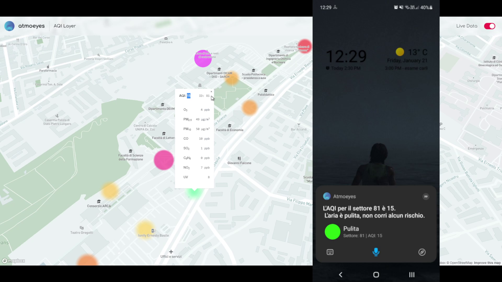

# AtmoEyes Demo

## What is this?

This repo contains all the code used for the demo presented by my team (_Group A_) in the final pitch for "Samsung Innovation Campus 2021 Smart Things Edition" @ UNIPA (University of Palermo). 
\
\
Me and other two members of my team won the edition.
\
\
Here's our [pitch](doc/pitch.pdf), and a brief video of the [working demo](doc/demo.mkv).

